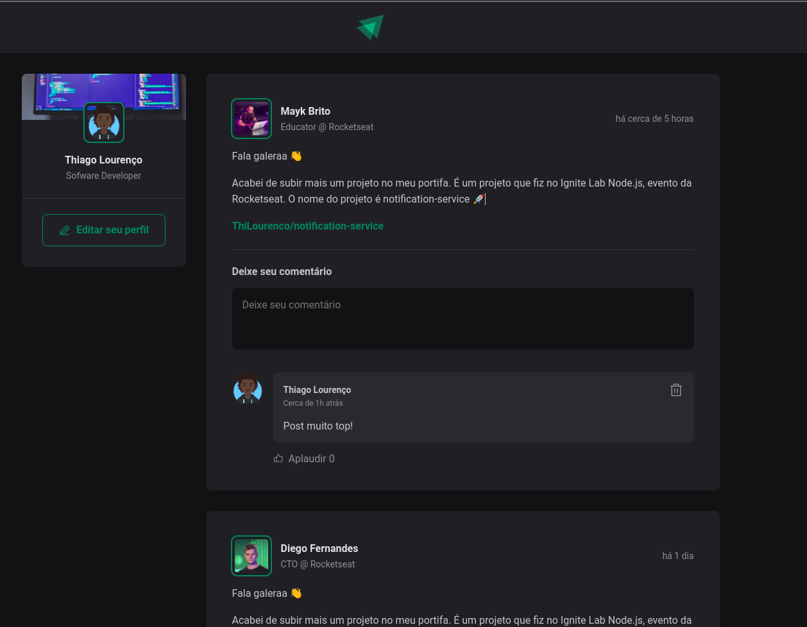

<h1 align="center"> Ignite Feed </h1>


<h1 align="center" >
  
</h1>

## Technologies

- [ReactJs](https://reactjs.org)
- [Vite](https://lottiefiles.com/)
- [Date-fns](https://date-fns.org/)
- [Phosphor-Icons](https://phosphoricons.com/)


## Run project

Clone the project and access the folder.

```bash
$ git clone git@github.com:Thilourenco/ignite_feed.git
$ cd ignite_feed
```

- [Node.js](https://nodejs.org/en/)
- Package Manage ([Npm](https://www.npmjs.com/) ou [Yarn](https://yarnpkg.com/))

Follow the steps below:

```bash
# Install the dependencies
$ yarn or npm i
# Start the project
$ yarn dev or npm run dev
```

The app will be available for access on your browser at http://localhost:3000

## 🔖 Layout

You can view the project layout through the [link](https://www.figma.com/file/9MvX8txcUCkhY4j7SV6BMH/Ignite-Feed-(Community)). It is necessary to have a [Figma](https://figma.com) account to access it.


## 📝 License

This project is licensed under the MIT License. See the [LICENSE](LICENSE.md) file for details.

---

<p align="center">Create by <a href="https://github.com/thilourenco">Thiago Lourenço</a></p>